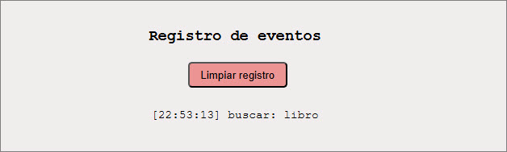
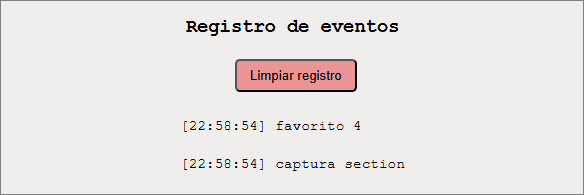
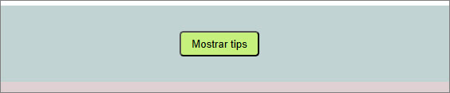
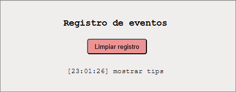
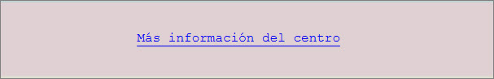
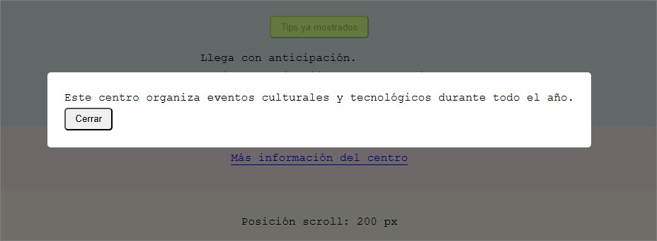

# ejercicio4
ejercicio 4 / Modulo VI - Vue

ejercicio desplegado: https://ramirezjm.github.io/ejercicio4/

[](https://choosealicense.com/licenses/mit/)


App 'Centro de Eventos' que permite mostrar eventos del DOM en Vue, manejadores en línea y métodos, modificadores de eventos y teclas. Contiene un registro de eventos que permite ver los últimos 15 eventos ocurridos en el DOM.

## Búsqueda con enter / esc
'Enter' permite ejecutar búsqueda y 'esc' limpiar el cuadro de búsqueda, mostrando todos los resultados.

   ```HTML
   <input v-model="terminoBusqueda" type="text" placeholder="Buscar evento..." @keyup.enter="buscar"
          @keydown.esc="limpiar" />
   ```

<div>
  
  
</div>
<div>
  
  
</div>

## Click con stop
Un botón 'favorito' con @click.stop evita que el click se propague a la tarjeta

```HTML
<button class="favorito" @click.stop="toggleFavorito">
```

<div>
  
  
</div>

## Captura
El contenedor de tarjetas contiene @click.capture="logCaptura" que permite evidenciar el orden de captura vs propagación

```HTML
<section @click.capture="logCaptura" class="tarjetas">
```

<div>
  
  
</div>

## Acción única
Un botón 'Mostrar tips' funciona solo una vez, luego se deshabilita y cambia su texto.

```HTML
 <button @click.once="mostrarTips" :disabled="tipsMostrados">
    {{ tipsMostrados ? 'Tips ya mostrados' : 'Mostrar tips' }}
 </button>
```

<div></div>
<div></div>
<div></div>

## Scroll pasive
Un contenedor con altura fija y varios elementos para forzar el scroll, reflejando la posición en un indicador.

```HTML
<div class="scroll-box" @scroll.passive="onScroll">
```

<div>
  
</div>

## Enlace prevent
Enlace que no navega, sino que abre un modal

```HTML
<a href="https://example.com" @click.prevent="abrirModalInfo">
   Más información del centro
</a>
```

<div></div>
<div></div>
<div></div>


### Clonar el repositorio

  ```bash
   git clone https://github.com/RamirezJM/ejercicio4.git
   cd ejercicio4
  ```

### Instalar dependencias

```bash
npm install
```

### Levantar el servidor

```bash
npm run dev
```
